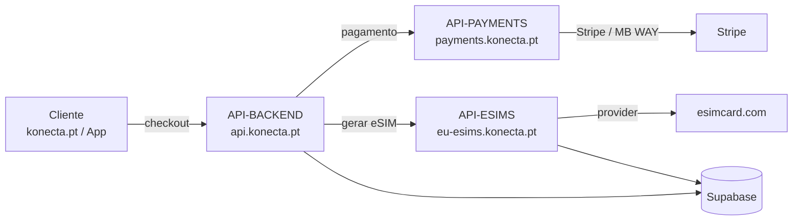
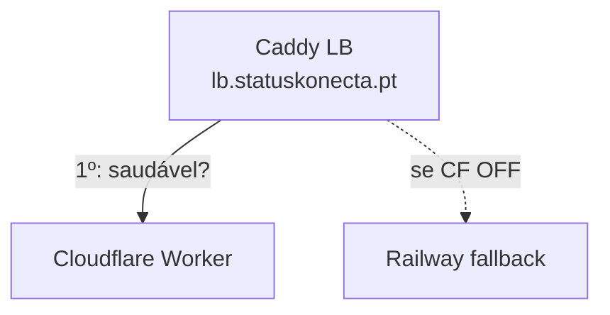

## Fluxo de um pedido (compra de eSIM)

- O **site/App** falam com o **API-BACKEND** (auth, pedidos, checkout).
- O **API-BACKEND** delega o pagamento no **API-PAYMENTS** e a criação/gestão do
  eSIM no **API-ESIMS**.
- Toda a persistência é no **Supabase**.

## Principal vs. Secundário

<Note>
**Cloudflare (Workers + Pages) = PRINCIPAL.** Tudo o que está fora de Workers/Pages
é **secundário** (fallback), alojado em **Railway** sob `statuskonecta.pt`.
</Note>

| Serviço | Principal (Cloudflare) | Secundário (Railway) |
|---|---|---|
| API-BACKEND | `konecta-api.konecta-pt.workers.dev` | `api-backend.statuskonecta.pt` |
| API-ESIMS | `konecta-esims.konecta-pt.workers.dev` | `api-esims.statuskonecta.pt` |
| API-PAYMENTS | `konecta-payments.konecta-pt.workers.dev` | `api-payments.statuskonecta.pt` |
| admin-dashboard | `admin.konecta.pt` | `admin.statuskonecta.pt` |

## Load Balancer / Failover

O [LB (Caddy)](/repos/load-balancer) é o **caminho de troca**: quando um serviço
principal (Cloudflare) fica OFF, encaminha para o secundário (Railway),
automaticamente por health-check.

- Vive num **domínio isolado próprio** (ex.: `lb.statuskonecta.pt`), separado dos
  `api-*` e do `admin`, para poder fazer as trocas.
- Política **ativo-passivo**: Cloudflare primário, Railway reserva
  (`lb_policy first` + health-checks a `/health`).

<Warning>
O **site público (konecta.pt) não precisa de failover** — se cair, pode reencaminhar
para a status page (`statuskonecta.pt`). O que **tem** de ficar ON são as
**APIs + o admin**.
</Warning>

## IVA

O IVA é **sempre 23%**, incluído no valor apresentado e cobrado. No backend, o
checkout soma o imposto ao valor líquido; no frontend, os preços são mostrados já
com IVA (`grossEur`, `withVat`).
