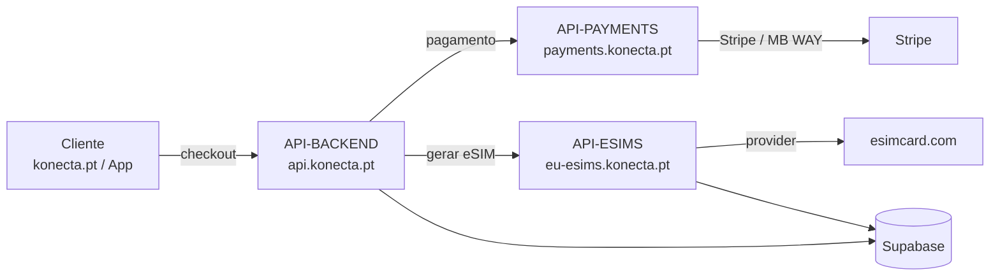

## Fluxo de um pedido (compra de eSIM)

- O **site/App** falam com o **API-BACKEND** (auth, pedidos, checkout).
- O **API-BACKEND** delega o pagamento no **API-PAYMENTS** e a criação/gestão do eSIM no **API-ESIMS**.
- Toda a persistência é no **Supabase**.

## Infraestrutura & estado

Toda a infraestrutura corre em **Cloudflare** (Workers \+ Pages). A monitorização é feita pelo **OneUptime** em `https://statuskonecta.pt/` (alojado fora da Cloudflare): se algum serviço cair, a status page mostra-o. Ver [Monitorização](/status-monitoring).